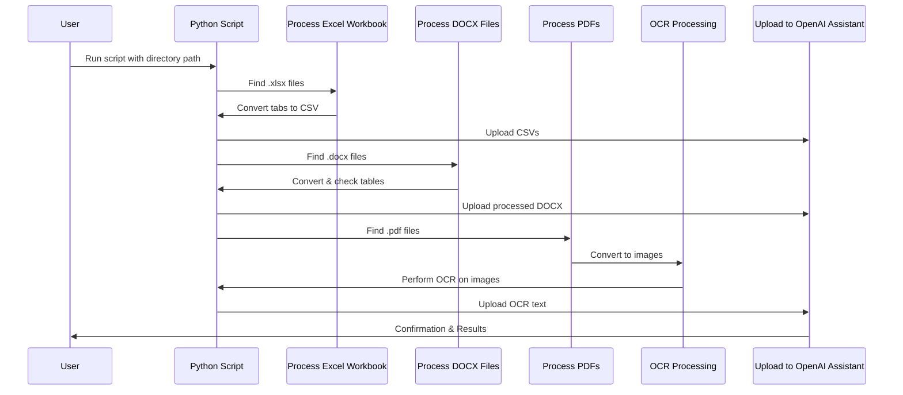

# AI-Powered Bid Assessment Tool

## Introduction

This repository contains an AI-powered tool designed to assess bid submissions effectively. Utilizing a custom AI model, this tool evaluates submissions based on a predefined rubric, aiming to streamline the assessment process and enhance decision-making accuracy.

## Features

- **Automated Bid Evaluation:** Leverages AI to score bid submissions against a comprehensive assessment rubric.
- **Customizable Rubric:** Easy to adapt the assessment criteria based on specific project requirements.
- **Detailed Feedback:** Provides in-depth feedback and suggestions for each submission to support improvements.
- **User-Friendly Interface:** A streamlined interface for both administrators and users to submit and review bids.

## Requirements

Before installing and running this project, ensure you have the following:

- Python 3.8 or newer
- Pip package manager
- Additional Python dependencies listed in `requirements.txt`

## Installation

To set up the project on your local machine, follow these steps:

1. Clone the repository:
git clone <repository-url>

2. Navigate to the project directory:
cd <project-name>

3. Install the required Python packages:
pip install -r requirements.txt

## Usage

To start the application, run:

streamlit run StreamLitMarkThis.py

Follow the on-screen instructions to upload bid submissions and receive assessments.

## Configuration

The assessment rubric can be customized by editing `assessment_rubric.json`. Refer to `instructions.txt` for guidelines on adapting the rubric to fit your assessment criteria.

## Contributing

Contributions to improve the tool are welcome. Please follow these steps to contribute:

## License

This project is licensed under the Apache-2 License - see the [LICENSE](LICENSE) file for details.

